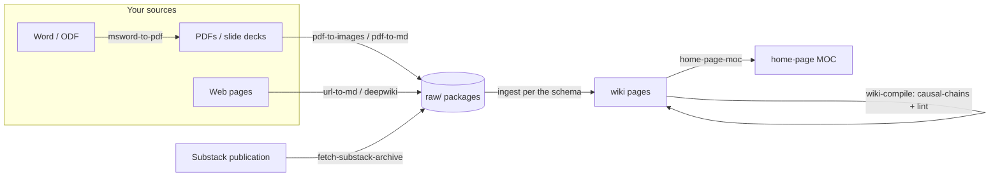

# llm-wiki-toolkit

> The skills that build and maintain an LLM wiki. Companion to **[compounding-llm-wiki](https://github.com/hmbseaotter/compounding-llm-wiki)**.

This repo bundles the [Claude Code](https://claude.com/claude-code) skills that turn raw source
documents — PDFs, slide decks, Word/ODF files, web pages — into a structured, cross-linked knowledge
wiki, plus the maintenance skills that keep that wiki consistent. It is the **companion** to the
`compounding-llm-wiki` template:

- **[compounding-llm-wiki](https://github.com/hmbseaotter/compounding-llm-wiki)** is the *what* — the
  wiki **schema** (its `CLAUDE.md`), the page types, and the empty knowledge base you grow over time.
- **llm-wiki-toolkit** (this repo) is the *how* — the **skills** that ingest sources into that schema
  and maintain the result.

Clone both, install the skills, and you have the full system — the same toolchain used to build a
full knowledge base from real source material (PDFs, slide decks, and more).

---

## Why two repos?

The wiki template is meant to be cloned and grown into *your* knowledge base — it should stay small and
content-focused. The skills are machine-level tools that live in your Claude Code config
(`~/.claude/skills/`), shared across every wiki you build. Splitting them keeps each repo
single-purpose: update the toolkit once, and every wiki you maintain benefits.



---

## What's inside

| Skill | Files | What it does |
|---|---|---|
| `/pdf-to-images` | `pdf-to-images.md` + `.py` | Rasterize each PDF page to a numbered PNG (default 200 DPI) so every page goes through the vision pass. `--mode package` also writes `article.md` from the text layer. **Pass 1** of the two-pass slide workflow. |
| `/pdf-to-md` | `pdf-to-md.md` | Extract a **genuinely text-only** PDF straight to `article.md` (no rasterization). Shares the `pdf-to-images` engine and **fails safe**: if it detects any graphic-layer content it rasterizes instead. |
| `/image-to-md` | `image-to-md.md` | Vision extraction of text **and** relationships (tables, flows, diagram labels) from one or many images. **Pass 2** of the two-pass slide workflow. |
| `/msword-to-pdf` | `msword-to-pdf.md` + `.py` | Convert `.doc/.docx/.rtf/.odt` to PDF via LibreOffice headless, so Word docs feed the same pipeline as PDFs. |
| `/url-to-md` | `url-to-md.md` | Download any URL as a self-contained folder: clean markdown + images with relative links. *(Requires Firecrawl — see below.)* |
| `/deepwiki` | `deepwiki.md` | Fetch a URL, digest it into a structured summary, and answer follow-up questions (GitHub repos auto-route to DeepWiki). *(Requires Firecrawl.)* |
| `/fetch-substack-archive` | `fetch-substack-archive.md` + `.py` | Download a **whole Substack publication's** back-catalogue as clean, self-contained Markdown (one `.md` per post, chrome stripped, in-content images kept, provenance frontmatter). Uses Substack's JSON API — **no Firecrawl**; resumable + rate-limit-safe. *(Requires `markdownify`.)* |
| `/home-page-moc` | `home-page-moc.md` + `.py` | (Re)generate the wiki's Obsidian Map of Content (`home-page.md`): a deterministic A–Z index of every page. Stdlib-only. |
| `/wiki-compile` | `wiki-compile.md` | The **finishing step**: build the deferred causal-chain pages, run the full lint, and regenerate the MOC. Run after a round of ingestion or after manual edits. |

---

## Prerequisites

- **[Claude Code](https://claude.com/claude-code)** — the skills are Claude Code skills.
- **Python 3.9+** — for the `.py` engines.
- **[PyMuPDF](https://pymupdf.readthedocs.io/)** — the PDF rasterization/extraction engine used by
  `/pdf-to-images` and `/pdf-to-md`. Installed via `requirements.txt` below.
- **[markdownify](https://pypi.org/project/markdownify/)** — HTML→Markdown converter used by
  `/fetch-substack-archive`. Pure Python (no pandoc). Installed via `requirements.txt` below.
- **LibreOffice** *(optional)* — only for `/msword-to-pdf`. MS Word itself is **not** required.
  `winget install --id TheDocumentFoundation.LibreOffice` (Windows), or your platform's package manager.
- **Firecrawl** *(optional)* — only for `/url-to-md` and `/deepwiki`. See **[Web sourcing](#web-sourcing-with-firecrawl-optional)**.

---

## Install

The skills must live in your Claude Code skills directory, `~/.claude/skills/`.

**Windows (PowerShell):**
```powershell
./install.ps1
```

**macOS / Linux:**
```bash
./install.sh
```

The installer copies every `skills/*.md` and `skills/*.py` into `~/.claude/skills/`. Re-run it after
you `git pull` updates. Then install the Python engine dependency (Windows: `pip`; macOS/Linux:
`pip3`):

```bash
pip install -r requirements.txt
```

That's it. In Claude Code, invoke a skill by name — e.g. `/pdf-to-images deck.pdf`, `/image-to-md slides/`,
`/wiki-compile`.

> **How invocation works:** Claude Code discovers skills placed in `~/.claude/skills/`. Depending on
> your setup, custom skills may be invoked by typing `/<skill-name>` or by asking the agent to run the
> skill by name. If a `/<name>` doesn't auto-resolve, just tell the agent: *"run the `<name>` skill"* —
> it will read `~/.claude/skills/<name>.md` and follow it.

### Installing the QA cores into a wiki

Two files are **not** skills and do not belong in `~/.claude/skills/`: `wiki-tools/contradiction_qa.py`
and `wiki-tools/structure_qa.py`. They live inside each wiki repo's `tools/`, because they are run
from the wiki root and are committed with it — so every clone carries its own QA, with no dependency
on the toolkit being installed.

| Core | Answers |
|---|---|
| `contradiction_qa.py` | which claim-level conflicts are open, by severity, and which are ageing |
| `structure_qa.py` | where the repo violates its own schema: duplicate slugs, index parity, stale pending-pointers, broken image links, out-of-vocabulary direction tokens |

```powershell
./install-wiki-tools.ps1                    # into the current directory's wiki
./install-wiki-tools.ps1 -WikiRoot D:\path\to\wiki
./install-wiki-tools.ps1 -Check             # report drift, change nothing (exit 1 if any)
```
```bash
./install-wiki-tools.sh                     # into the current directory's wiki
./install-wiki-tools.sh /path/to/wiki
./install-wiki-tools.sh --check /path/to/wiki
```

**This exists because copying does not hold.** These cores were hand-copied into each wiki once, and
by 2026-07-21 they had silently diverged by ~70 lines — one wiki's copy even documented a pipeline
that did not exist in it. Per-file the installer reports `NEW` / `UPDATED (target had drifted)` /
`unchanged`, so a local edit is named rather than silently overwritten, and `--check` exits non-zero
when anything is out of date — usable as a drift alarm. Re-run it after `git pull` and every wiki
tracks one upstream. It refuses any directory without `CLAUDE.md` and `wiki/`.

---

## Web sourcing with Firecrawl (optional)

`/url-to-md` and `/deepwiki` fetch live web pages through the **[Firecrawl](https://firecrawl.dev)** CLI,
authenticated with an API key. If you have never used Firecrawl, start here — without this setup these
two skills won't work (the rest of the toolkit, which works on local files, needs none of it):

1. **Get an API key.** Create an account at **[firecrawl.dev](https://firecrawl.dev)** (there's a free
   tier) and copy your API key from the dashboard's **API Keys** section.
2. **Install the Firecrawl CLI** so the `firecrawl` command is on your `PATH`. Follow the official
   instructions at **[docs.firecrawl.dev](https://docs.firecrawl.dev)** for your platform. The
   `/url-to-md` skill calls, e.g., `firecrawl scrape <URL> -f markdown -o article.md`.
3. **Authenticate the CLI** with your key — typically by setting the `FIRECRAWL_API_KEY` environment
   variable (or running the CLI's login command). Follow whatever the current Firecrawl docs specify.
4. **Verify** it works:
   ```bash
   firecrawl scrape https://example.com --only-main-content -f markdown -o test.md
   ```
   If that produces a clean `test.md`, `/url-to-md` and `/deepwiki` are ready.

If you'd rather not set this up, skip these two skills — `/pdf-to-images`, `/pdf-to-md`, `/image-to-md`,
`/msword-to-pdf`, `/fetch-substack-archive`, `/home-page-moc`, and `/wiki-compile` all work without
Firecrawl. (`/fetch-substack-archive` sources from the web too, but via Substack's own JSON API, so it
needs `markdownify` rather than Firecrawl.)

---

## Companion repo

Pair this with the wiki template it serves:

**→ [compounding-llm-wiki](https://github.com/hmbseaotter/compounding-llm-wiki)** — the LLM-wiki schema
and starter structure. Clone it for the wiki; clone this for the tools that fill and maintain it.

---

## License

MIT — see [LICENSE](LICENSE).
